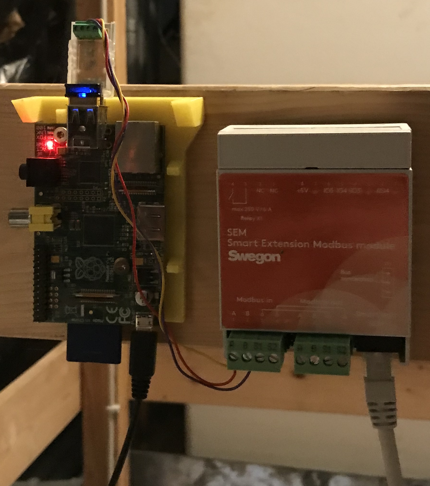

# Modpoll to SWEGON CASA W3

Thanks to incredible work of the contributors on [modpoll](https://github.com/gavinying/modpoll) project, it's quite easy to read and control your Swegon Casa W3 with mqtt queries. This allows me to use it in OpenHAB and other HA systems.

## Prerequisitions

* RaspberryPI with Raspbian (I took a Raspberry Model B, fast enough, re-use it, don't loose it)
* [RS485 to USB with FTDI chipset](https://amzn.to/3T8HuWF) (affiliate)
* [Swegon Smart Modbus Modul](https://www.swegon.com/products-and-services/air-handling/air-handling-units/casa/casa-sem/)

## Installation: Hardware

Add the SEM module to your CASA device like described in Manual. If you are not sure, ask your plumber.

Connect the adapter in this scheme to the SEM. 

* Data+ -> A
* Data- -> B
* Gnd -> S1

Keep in mind to set the terminator for the SEM like described in manual, if you don't have more than one module in a row.



Make sure you set the right settings for modbus on device.


## Installation: Software

1. Open a shell on your raspi and install modpoll.
   ```
   apt-get update
   apt-get install pip -y
   pip install modpoll
   ```
2. Clone repo and replace <mqtt_host>, <mqtt_user> and <mqtt_pass> in run.sh
3. Start run.sh

## Advanced: Run as Service

There is a swegon.service file to run modpoll in service mode without attending.

## Advanced: OpenHAB

You can define your device "thing" like this in OpenHAB.

kwl.things
```
Thing mqtt:topic:kwl "Kontrollierte Wohnraumlüftung"(mqtt:broker:XXXXXX) {
    Channels:
        Type number : kwl_air_fresh "Frischluft" [stateTopic="modpoll/swegon1", transformationPattern="JSONPATH:$.air_fresh∩JS:round_one_in.js"]
        Type string : kwl_operating_mode "Modus" [allowedStates="Stop,Abwesend,Normal,Boost,Verreist", commandTopic="modpoll/swegon1/set", formatBeforePublish="{ \"object_type\": \"holding_register\", \"address\": 5000, \"value\": %s }", stateTopic="modpoll/swegon1",transformationPattern="JSONPATH:$.operating_mode∩MAP:kwl_operating_mode_action_text.map",transformationPatternOut="MAP:kwl_operating_mode_text_action.map"]
        Type number : kwl_air_supply_before_heater "Zuluft (Vor dem Nachheizen)" [stateTopic="modpoll/swegon1", transformationPattern="JSONPATH:$.air_supply_before_heater∩JS:round_one_in.js"]
        Type number : kwl_air_supply "Zuluft" [stateTopic="modpoll/swegon1", transformationPattern="JSONPATH:$.air_supply∩JS:round_one_in.js"]
        Type number : kwl_air_extract "Abluft" [stateTopic="modpoll/swegon1", transformationPattern="JSONPATH:$.air_extract∩JS:round_one_in.js"]
        Type string : kwl_sn_cooling "Sommernachtkühlung" [allowedStates="Aus,Niedrig,Normal,Hoch,Voll,Benutzerdefiniert", commandTopic="modpoll/swegon1/set", formatBeforePublish="{ \"object_type\": \"holding_register\", \"address\": 5163, \"value\": %s }", stateTopic="modpoll/swegon1", transformationPattern="JSONPATH:$.sn_cooling∩MAP:kwl_sn_cooling_action_text.map", transformationPatternOut="MAP:kwl_sn_cooling_text_action.map"]
        Type number : kwl_air_relative_humadity "Relative Luftfeuchtigkeit" [      stateTopic="modpoll/swegon1", transformationPattern="JSONPATH:$.air_relative_humadity", unit="%"]
}
```

kwl_operating_mode_text_action.map
```
Stop=0
Abwesend=1
Normal=2
Boost=3
Verreist=4
```
kwl_operating_mode_action_text.map
```
0=Stop
1=Abwesend
2=Normal
3=Boost
4=Verreist
```

kwl_sn_cooling_action_text.map
```
0=Aus
1=Niedrig
2=Normal
3=Hoch
4=Voll
5=Benutzerdefiniert
```

kwl_sn_cooling_text_action.map
```
Aus=0
Niedrig=1
Normal=2
Hoch=3
Voll=4
Benutzerdefiniert=5
```

## Advanced: Did I miss something?

You can find more to learn in the [modbus documentation of swegon](https://serviceportal.swegon.com/fi//docs/smartmodbusregisterfull).
